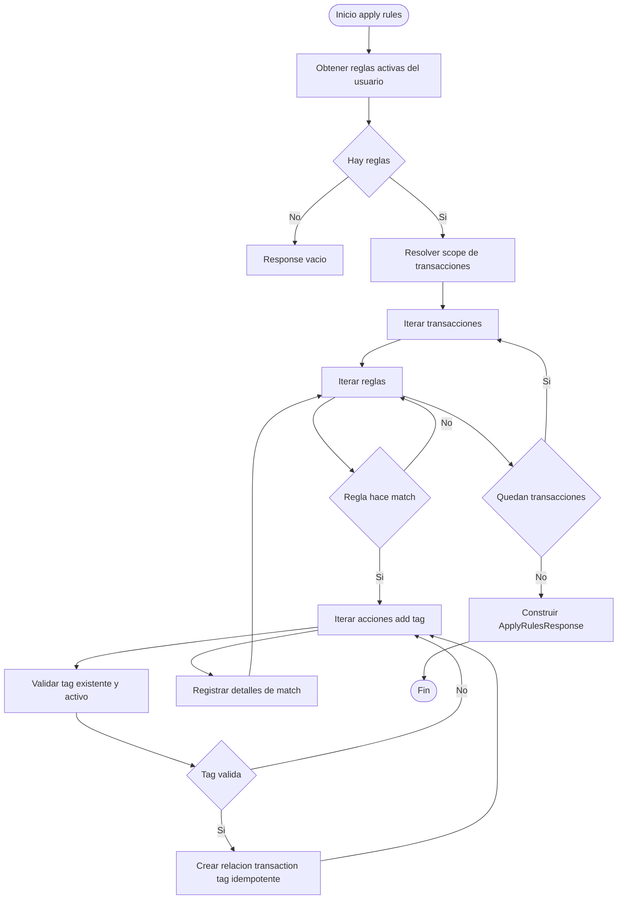

# Activity - Rules Application

```mermaid
flowchart TD
    A([Inicio apply rules]) --> B[Obtener reglas activas del usuario]
    B --> C{Hay reglas}
    C -- No --> Z[Response vacio]
    C -- Si --> D[Resolver scope de transacciones]
    D --> E[Iterar transacciones]
    E --> F[Iterar reglas]
    F --> G{Regla hace match}
    G -- No --> F
    G -- Si --> H[Iterar acciones add tag]
    H --> I[Validar tag existente y activo]
    I --> J{Tag valida}
    J -- No --> H
    J -- Si --> K[Crear relacion transaction tag idempotente]
    K --> H
    H --> L[Registrar detalles de match]
    L --> F
    F --> M{Quedan transacciones}
    M -- Si --> E
    M -- No --> N[Construir ApplyRulesResponse]
    N --> O([Fin])
```
