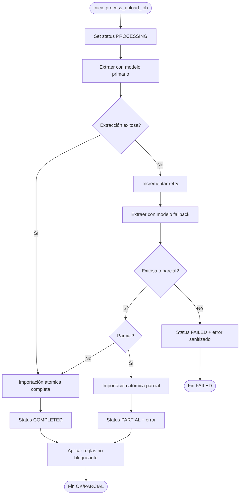

# Activity - Upload Processing

```mermaid
flowchart TD
    A([Inicio process_upload_job]) --> B[Set status PROCESSING]
    B --> C[Extraer con modelo primario]
    C --> D{Extracción exitosa?}

    D -- No --> E[Incrementar retry]
    E --> F[Extraer con modelo fallback]
    F --> G{Exitosa o parcial?}

    D -- Sí --> H[Importación atómica completa]
    G -- Sí --> I{Parcial?}
    I -- Sí --> J[Importación atómica parcial]
    I -- No --> H

    H --> K[Status COMPLETED]
    J --> L[Status PARTIAL + error]
    K --> M[Aplicar reglas no bloqueante]
    L --> M
    M --> N([Fin OK/PARCIAL])

    G -- No --> O[Status FAILED + error sanitizado]
    O --> P([Fin FAILED])
```
