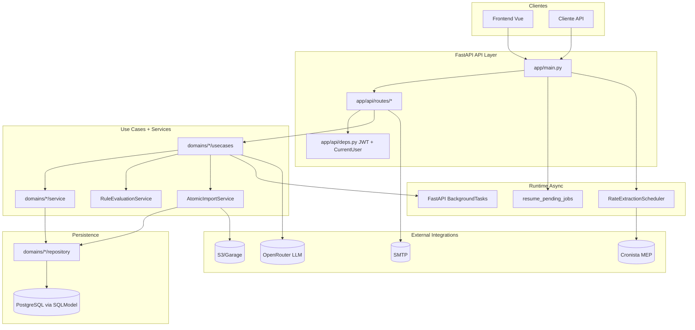

# Architecture - Backend

```mermaid
flowchart TB
    subgraph clients[Clientes]
        web[Frontend Vue]
        cli[Cliente API]
    end

    subgraph api_layer[FastAPI API Layer]
        main[app/main.py]
        routes[app/api/routes/*]
        deps[app/api/deps.py JWT + CurrentUser]
    end

    subgraph app_layer[Use Cases + Services]
        uc[domains/*/usecases]
        svc[domains/*/service]
        eval[RuleEvaluationService]
        atomic[AtomicImportService]
    end

    subgraph data_layer[Persistence]
        repo[domains/*/repository]
        db[(PostgreSQL via SQLModel)]
    end

    subgraph integrations[External Integrations]
        s3[(S3/Garage)]
        openrouter[(OpenRouter LLM)]
        cronista[(Cronista MEP)]
        smtp[(SMTP)]
    end

    subgraph runtime[Runtime Async]
        bg[FastAPI BackgroundTasks]
        startup[resume_pending_jobs]
        sched[RateExtractionScheduler]
    end

    web --> main
    cli --> main
    main --> routes
    routes --> deps
    routes --> uc
    uc --> svc
    uc --> eval
    uc --> atomic
    svc --> repo
    atomic --> repo
    repo --> db

    uc --> bg
    main --> startup
    main --> sched

    atomic --> s3
    uc --> openrouter
    sched --> cronista
    routes --> smtp
```
