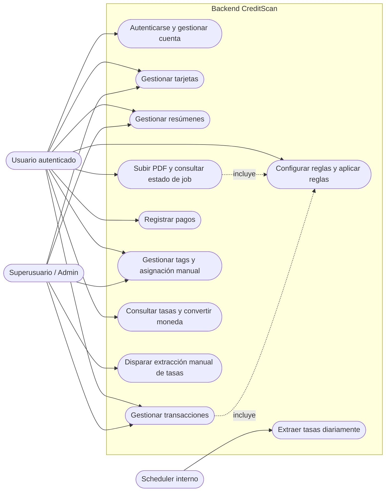

# Use Cases Backend

```mermaid
flowchart LR
    actor_user([Usuario autenticado])
    actor_admin([Superusuario / Admin])
    actor_scheduler([Scheduler interno])

    subgraph backend[Backend CreditScan]
        uc_auth([Autenticarse y gestionar cuenta])
        uc_cards([Gestionar tarjetas])
        uc_statements([Gestionar resúmenes])
        uc_upload([Subir PDF y consultar estado de job])
        uc_tx([Gestionar transacciones])
        uc_payments([Registrar pagos])
        uc_tags([Gestionar tags y asignación manual])
        uc_rules([Configurar reglas y aplicar reglas])
        uc_currency_query([Consultar tasas y convertir moneda])
        uc_currency_extract([Disparar extracción manual de tasas])
        uc_daily_extract([Extraer tasas diariamente])
    end

    actor_user --> uc_auth
    actor_user --> uc_cards
    actor_user --> uc_statements
    actor_user --> uc_upload
    actor_user --> uc_tx
    actor_user --> uc_payments
    actor_user --> uc_tags
    actor_user --> uc_rules
    actor_user --> uc_currency_query

    actor_admin --> uc_currency_extract
    actor_admin --> uc_cards
    actor_admin --> uc_statements
    actor_admin --> uc_tx
    actor_admin --> uc_tags

    actor_scheduler --> uc_daily_extract

    uc_upload -.incluye.-> uc_rules
    uc_tx -.incluye.-> uc_rules
```
