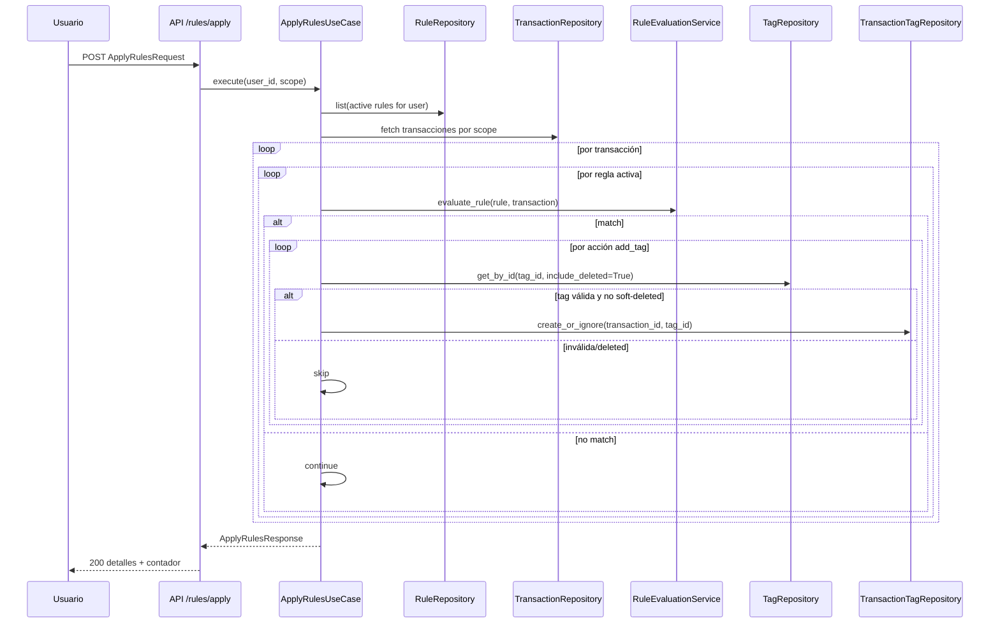

# Sequence - Apply Rules

```mermaid
sequenceDiagram
    participant U as Usuario
    participant API as API /rules/apply
    participant AR as ApplyRulesUseCase
    participant RR as RuleRepository
    participant TR as TransactionRepository
    participant EV as RuleEvaluationService
    participant TG as TagRepository
    participant TTR as TransactionTagRepository

    U->>API: POST ApplyRulesRequest
    API->>AR: execute(user_id, scope)
    AR->>RR: list(active rules for user)
    AR->>TR: fetch transacciones por scope

    loop por transacción
        loop por regla activa
            AR->>EV: evaluate_rule(rule, transaction)
            alt match
                loop por acción add_tag
                    AR->>TG: get_by_id(tag_id, include_deleted=True)
                    alt tag válida y no soft-deleted
                        AR->>TTR: create_or_ignore(transaction_id, tag_id)
                    else inválida/deleted
                        AR->>AR: skip
                    end
                end
            else no match
                AR->>AR: continue
            end
        end
    end

    AR-->>API: ApplyRulesResponse
    API-->>U: 200 detalles + contador
```
