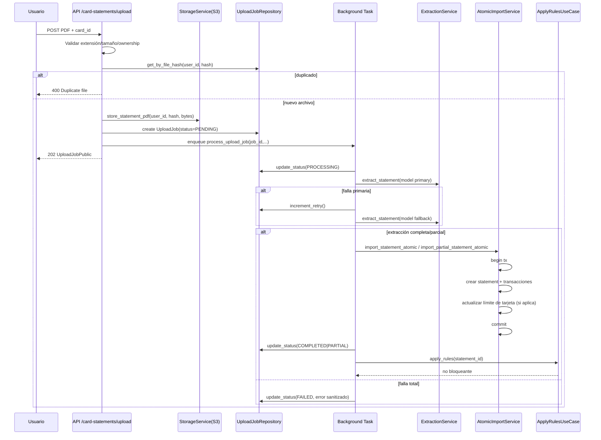

# Sequence - Upload Statement

```mermaid
sequenceDiagram
    participant U as Usuario
    participant API as API /card-statements/upload
    participant S3 as StorageService(S3)
    participant JOB as UploadJobRepository
    participant BG as Background Task
    participant EX as ExtractionService
    participant AI as AtomicImportService
    participant RU as ApplyRulesUseCase

    U->>API: POST PDF + card_id
    API->>API: Validar extensión/tamaño/ownership
    API->>JOB: get_by_file_hash(user_id, hash)
    alt duplicado
        API-->>U: 400 Duplicate file
    else nuevo archivo
        API->>S3: store_statement_pdf(user_id, hash, bytes)
        API->>JOB: create UploadJob(status=PENDING)
        API->>BG: enqueue process_upload_job(job_id,...)
        API-->>U: 202 UploadJobPublic

        BG->>JOB: update_status(PROCESSING)
        BG->>EX: extract_statement(model primary)
        alt falla primaria
            BG->>JOB: increment_retry()
            BG->>EX: extract_statement(model fallback)
        end

        alt extracción completa/parcial
            BG->>AI: import_statement_atomic / import_partial_statement_atomic
            AI->>AI: begin tx
            AI->>AI: crear statement + transacciones
            AI->>AI: actualizar límite de tarjeta (si aplica)
            AI->>AI: commit
            BG->>JOB: update_status(COMPLETED|PARTIAL)
            BG->>RU: apply_rules(statement_id)
            RU-->>BG: no bloqueante
        else falla total
            BG->>JOB: update_status(FAILED, error sanitizado)
        end
    end
```
