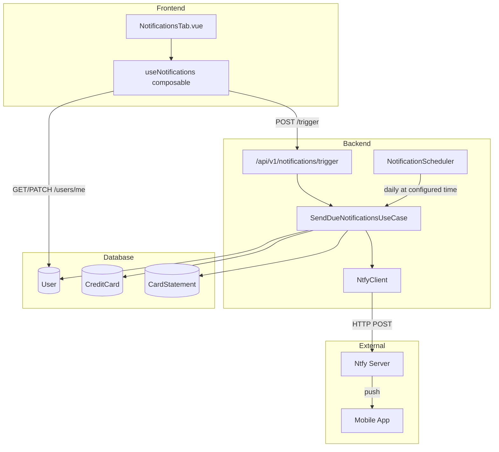
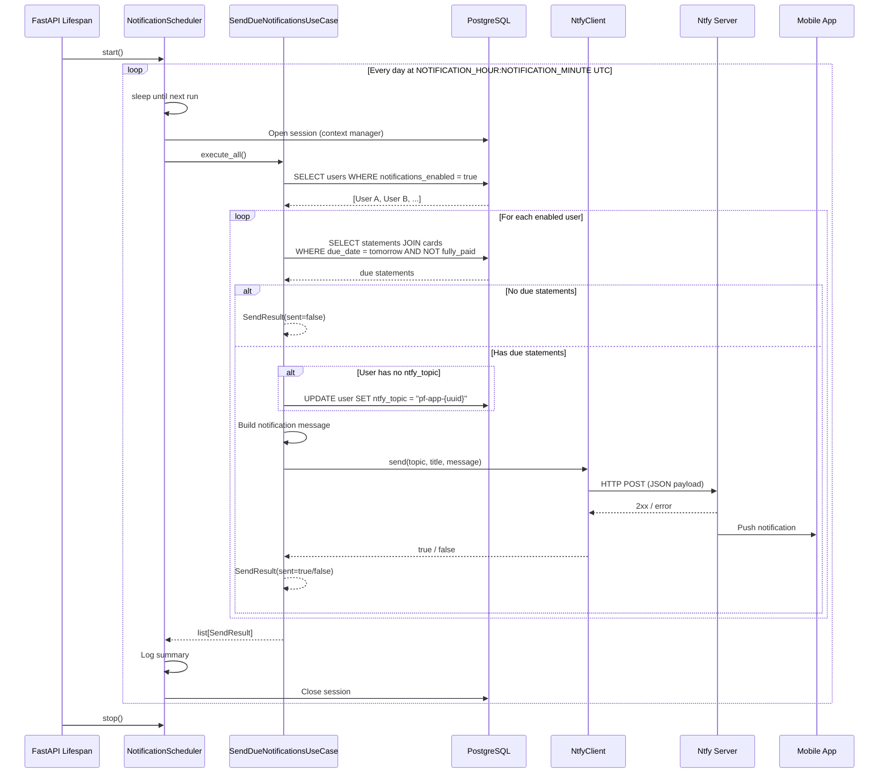
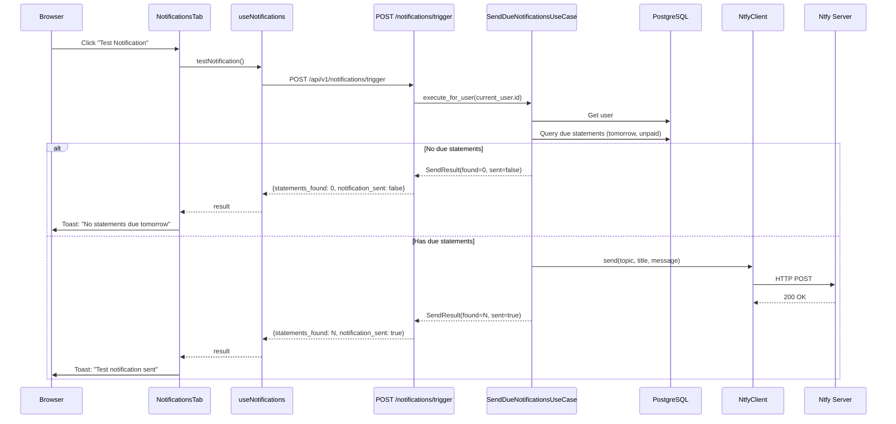
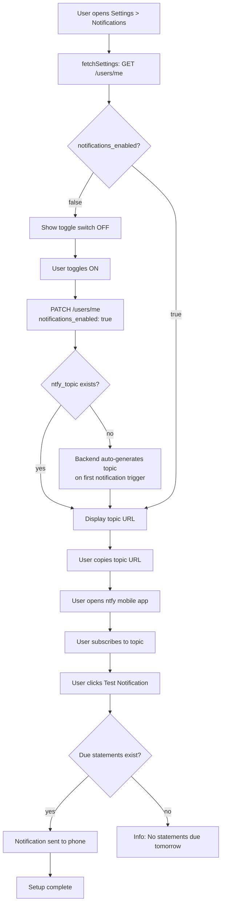
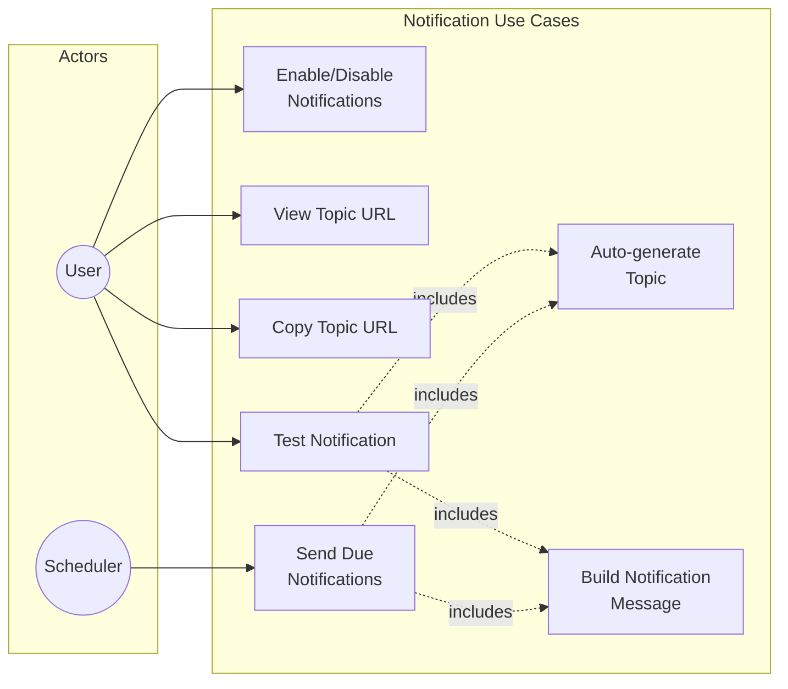

# Setting Up Push Notifications

## What is Ntfy?

[Ntfy](https://ntfy.sh) is a free, open-source push notification service. This project hosts its own ntfy instance to keep your data private and notifications reliable.

Notifications are sent daily (by default at 22:00 UTC) to remind you about credit card payments due the next day.

## Architecture

### System Overview

### Scheduled Notification Flow

### Manual Test Notification Flow

### User Onboarding Flow

### Use Case Diagram

## Installation

### iOS

1. Download **ntfy** from the [App Store](https://apps.apple.com/app/ntfy/id1625395874)
2. Open the app
3. Tap **Settings** (gear icon)
4. Under "Users & Appearance", tap **Add another server**
5. Enter your server URL (e.g. `https://ntfy.yourdomain.com`)
6. Tap **Save**

### Android

1. Download **ntfy** from [Google Play](https://play.google.com/store/apps/details?id=io.heckel.ntfy) or [F-Droid](https://f-droid.org/packages/io.heckel.ntfy/)
2. Open the app
3. Tap the **three-dot menu** > **Settings** > **Manage users**
4. Add your server URL (e.g. `https://ntfy.yourdomain.com`)
5. Tap **Save**

## Subscribing to Notifications

1. In the web app, go to **Settings** > **Notifications**
2. Toggle **Enable notifications** on
3. Copy the **topic URL** shown below the toggle (e.g. `https://ntfy.yourdomain.com/pf-app-abc123`)
4. In the ntfy mobile app, tap **+** (Subscribe to topic)
5. Paste the full topic URL
6. Tap **Subscribe**

You will now receive push notifications on your phone.

## Testing Your Setup

After subscribing, click the **Test Notification** button in the Notifications settings tab. If your setup is correct and you have credit card statements due tomorrow, you should receive a notification on your phone within a few seconds.

If there are no statements due tomorrow, the test will report "No statements due tomorrow" -- this is expected behavior.

## Timezone and Scheduling

Notifications are scheduled in **UTC**. The default time is 22:00 UTC. This can be configured by the server administrator via the `NOTIFICATION_HOUR` and `NOTIFICATION_MINUTE` environment variables.

The ntfy container timezone can be configured separately via the `NTFY_TIMEZONE` environment variable (defaults to UTC).

## Troubleshooting

### Not receiving notifications?

- Verify you are subscribed to the correct topic URL in the ntfy app
- Check that your phone allows notifications for the ntfy app (Settings > Notifications > ntfy)
- Make sure the server URL in the ntfy app matches your instance
- Try sending another test notification from the web app

### Topic URL changed?

Your unique topic is generated when you first enable notifications. If you need a new topic:

1. Toggle notifications **off**
2. Toggle notifications **back on**
3. A new topic will be generated
4. Update your subscription in the ntfy mobile app with the new URL

### No notification on test?

The test button triggers the same logic as the daily scheduler. If there are no unpaid statements due tomorrow, no notification will be sent -- the button will show an info message instead.

## Privacy and Security

- Your topic URL is **unique to your account** -- it acts like a private channel
- **Anyone who knows your topic URL** can subscribe to your notifications, so keep it private
- Topic names only contain letters, numbers, dashes, and underscores
- You can regenerate your topic at any time by toggling notifications off and on again
- All notification data stays on your self-hosted ntfy instance
